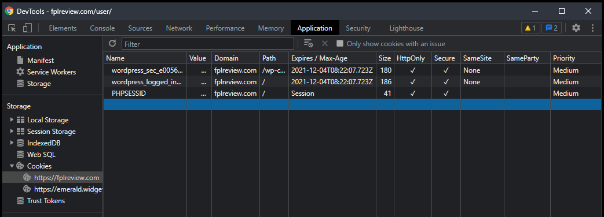

# Overview
This repo is meant to serve as a proof of concept for bypassing the login CAPTCHA on the FPL Review website by using pre-generated session cookies that are created ahead of time for the purpose of automated testing.

# Requirements
- **Selenium web driver** - This script uses the Chrome driver but I'm sure you could get it to work with Firefox with enough effort.

# Usage
1. Clone this Github repo with either:
    - ```shell
      $ git clone https://github.com/jameseisele/fplr-cookies
        ```
    - Select `Code` on the repo page and `Download ZIP`.

2. Enter the repository (unzip it first if you downloaded from GitHub).

3. Add your FPL Review login credentials to the `fplr_credentials.json` file.

4. Install the latest [ChromeDriver](https://chromedriver.chromium.org/downloads) if you haven't already and specify it's path in both `generate-sessions.py` and `import-sessions.py`:
    ```python
    chrome_service = Service(r'C:\\WebDriver\\bin\\chromedriver.exe')
    ```

5. Run the script according to your use case as outlined in the [Generating / Exporting Cookies](#Generating-/-Exporting-Cookies) section.
    ```powershell
    PS C:\fplr-cookies> python3 generate-sessions.py
    ...
    ```
# Cookies

## Generating / Exporting Cookies

**DO NOT SHARE YOUR COOKIES WITH ANYONE ELSE!** All session cookies from this project are stored in the `\sessions` directory and are excluded via the `.gitignore` file.
```powershell
PS C:\fplr-cookies> python3 generate-sessions.py
How many sessions do you want to generate? [1]: 4

DevTools listening on ws://127.0.0.1:54238/devtools/browser/fae6c645-e6cd-48ba-8348-79df3051975

# Chromium is launched and you'll be redirected to the login page with your credentials already
# filled in. All you need to do is complete the CAPTCHA for each session you want to generate
# (it helps to act like you're 50 years older than you already are).

1 - Successfully saved session data to \sessions\20211204T131106Z-sessiondata
2 - Successfully saved session data to \sessions\20211204T131206Z-sessiondata
3 - Successfully saved session data to \sessions\20211204T131306Z-sessiondata
4 - Successfully saved session data to \sessions\20211204T131406Z-sessiondata
```

There's a timer set to skip your current session after 3 minutes (180 seconds) in case something is wrong on the page. If you're still having a difficult time finishing your CAPTCHAs within this period you can increase the `timer` limit or remove it entirely.

All exported sessions are saved in their own directories and are named by their expiration dates. These are all formatted after ISO 8601 following UTC.

## Importing Cookies
`import-session.py` lays the framework for importing session cookies but doesn't do much by default. On run, it will list all available sessions that have been previously generated, import their data into Chromium, and go to the corresponding FPLR account page. All sessions are checked for expired names, i.e. if a directory's name (expiration date) has passed then it will be deleted.

```powershell
PS C:\fplr-cookies> python3 import-sessions.py
Existing sessions:
 - C:\fplr-cookies\sessions\20211204T131106Z-sessiondata
 - C:\fplr-cookies\sessions\20211204T131206Z-sessiondata
 - C:\fplr-cookies\sessions\20211204T131306Z-sessiondata
 - C:\fplr-cookies\sessions\20211204T131406Z-sessiondata

--------------------------------------------------------------------------------
...
```

# Limitations
Note that cookies expire on their own after a set period of time. As an example, you can view this on Chrome: `F12` > `Application` > under `Storage` expand the `Cookies` section > select the cookies in question to view more details. For our use case, we really only care about the `wordpress_logged_in_...` cookie. As of November 2021 session cookies were expiring after about 15 days.




# Further considerations
- When it comes to implementing async functionality within a scraper, actively using the same session cookie(s) across multiple functions may result in some unexpected behavior from the host site. Further testing is recommended.